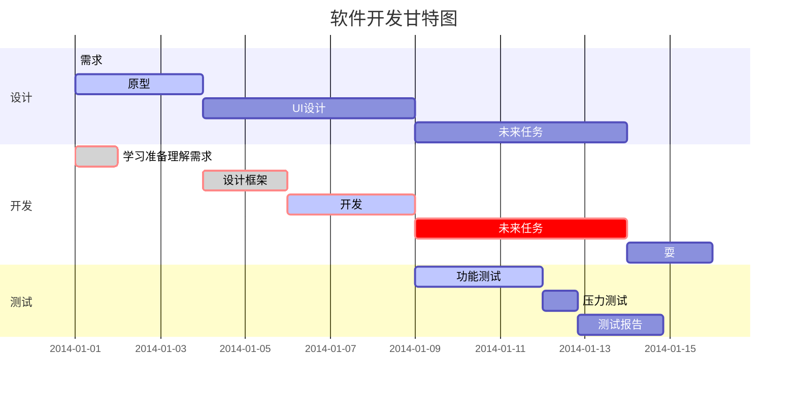

# 0基础markdown入门
## 前言
在markdown的官方教程里面写道：
>Markdown是一种轻量级标记语言，排版语法简洁，让人们更多地关注内容本身而非排版。它使用易读易写的纯文本格式编写文档，可与HTML混编，可导出 HTML、PDF 以及本身的 .md 格式的文件。因简洁、高效、易读、易写，Markdown被大量使用，如Github、Wikipedia、简书等。

简单来说markdown有这些好处：
1. 基本上可以在书写文档时只使用键盘，不需要手在键盘和鼠标之间反复横跳就能写好公式、图表、代码块等
2. 只要能编译通过就丑不到哪里去，下限很高
3. 可以和HTML等梦幻联动，上限也有无限可能
4. 可以在vscode里面输入，给室友一种你在写代码的错觉（压力怪上线了

官方文档对markdown也有相当详细的介绍，其他如菜鸟教程的介绍也是如此。而本文旨在让人能快速入门，省去了许多复杂的细节而专注于如何快速制作出一篇排版清爽的文章。

## 使用markdown的准备工作
>vscode,启动！

就像嗦米粉少不了香菜，程序员也少不了vscode，没有vscode只能度过相对失败的人生（突然暴论）

咳咳，说着玩的，但是vscode真的很好用，我知道你们能举出来很多其他优秀软件，但是我就一臭写文档的，听不见:yum:

### vscode怎么启动？
先在官网上下载安装
[官网链接](https://code.visualstudio.com/download)
请注意，要是打开是反诈提醒，那就还请另外寻找魔法到达那个网页（后果自负，因为任何邪恶终将绳之以法:punch::punch:），或者在其他镜像站下载，只是小心遇见下崽器，在此不提供其他方法。
然后打开一看，欸？怎么是英文。要是你是英语高手可以忽略，如果不是，请下载中文补丁：
1. 点那个红框位置

2. 输入“Chinese (Simplified) Language Pack for Visual Studio Code”并敲回车键
3. 选择结果第一个，点击install安装，然后重启即可

以上是对[知乎文章](https://zhuanlan.zhihu.com/p/263036716)的简要总结，没看懂可以移步原文。
类似地，你还需要下载Markdown Preview Enhanced插件来完成对markdown文档的实时查看。安装成功后，你可以选择在vscode里面打开（比如你面前正在看这个）或者新建一个.md文件并且ctrl+k,v来使用markdown预览。

在看本文档后面的内容时，你也需要对照看输入输出，并尝试改一改输入内容，体会体会。

那么，现在是时候从写标题开始正式踏上markdown的写作之旅了：
## 从标题到结尾
### 小点的标题
###### 最小的标题
\#越多标题越小，分别按\#的数量称为1到6级标题
（markdown有许多专用字符，想原样输出请使用转义符\，也就是反斜杠）
本文文首那个标题是最大的，可以翻回去看看哟，这里就不展示了，我有强迫症。
>注意，标题也是结构的重要部分，有时可以在长文档里帮助读者查找内容，不要为了写几个加粗的字滥用标题，后面会讲解如何加粗的

### 引用（区块）
在上面已经出现了许多次这种灰不拉几的文字框，可以框一点东西让内容看起来很高级

> 在行首（段首）加上一个大于符号就行，就像这样。是不是很高级？甚至可以嵌套：
最外层
> > 第一层嵌套
> > > 第二层嵌套

### 有序列表:
分点列出东西是讲话有条理的表现，这时可以使用有序列表：
1. 第一项
2. 第二项

仔细看看，这个和之间写1. 2.有没有区别，注意要让1. 2.变成蓝色
### 无序列表
有的时候我们列出来一些东西之间是并列关系，并无顺序之分，这时可以考虑无序列表
* 啊啊啊！
* 哇哇哇！
* 哦哦哦！

开头用加号也是一模一样的效果

+ 啊啊啊！
+ 哇哇哇！
+ 哦哦哦！

### 列表嵌套
1.  1
    * 1-1
    * 1-2
    * 1-3
2.  2
    * 2-1
    * 2-2

### 列表也能放进区块：
> 区块中使用列表
> 1. 第一项
> 2. 第二项
> + 第一项
> + 第二项
> + 第三项

### 字体

*斜体文本*
_斜体文本_
**粗体文本**
__粗体文本__
***粗斜体文本***
___粗斜体文本___

从斜到粗到又粗又斜

###怎么添加代码？

`printf()` 函数
俩单引号就行了

#####代码块呢？
加个tab

    #include<stdio.h>
    int main(){
        return 42842195;
    }

哎，语法高亮呢

```c
#include<stdio.h>
    int main(){
        return 42842195;
    }
```
那个```是1那个键左边在英文输入法下敲出来的

### 加入链接

链接是这样用的：

[链接名称](链接地址)或者
<链接地址>

举个例子：
[原神，启动！](https://www.yuanshen.com/#/)
或者
<https://www.yuanshen.com/#/>


### 加入图片
>就算是文档，没有图片也就没灵魂捏


这个芭芭拉有点太大了（迫真
所以可以考虑写img标签


>变大变小真的奇妙~~

### 制作表格

|  表头   | 表头  |
|  ----  | ----  |
| 单元格  | 单元格 |
| 单元格  | 单元格 |

| 左对齐 | 右对齐 | 居中对齐 |
| :-----| ----: | :----: |
| 单元格111 | 111单元格 | 11单元格 |
| 单元格1 | 1单元格 | 单元格11 |

### 输入公式
$f(x)=e^x+\frac{1}{x}+\sqrt\pi$ 或者 \(f(x)=e^x+\frac{1}{x}+\sqrt\pi\) 中的数学表达式将会在行内显示。
$$ax^2+bx+c=0$$ 或者 \[ax^2+bx+c=0\]中的数学表达式将会在块内显示。尽管没有写在中间但是会显示在中间
更多公式相关请参考latex。

### 其他花里胡哨的功能
1. 和html联动（前提是你得会html），例如:
>使用 <kbd>Ctrl</kbd>+<kbd>Alt</kbd>+<kbd>Del</kbd> 启动原神
2. 一些扩展语法，例如：
    1. 删除线
    ~~我是山里灵活的狗~~
    使用~~加在前后实现
    2. 代办事项表
        - [x] 下载原神
        - [x] 原神启动
        - [ ] 卸载原神
    3. 脚注
        你可以给这句话加注释。 [^1]
        注释在本页最下面。
        [^1]: 我也不知道写什么注释。
    4. emoji
        首先你可以去QQ之类的地方直接复制😝，不过有的时候显示出来效果会有差别。
        也可以写表情简码，格式是在表情名字前后使用英文冒号，就像这样：
        :laughing::laughing::laughing::laughing:
        查阅表情名字请移步[这个链接](https://zhuanlan.zhihu.com/p/351761548)
        这里给出一些我喜欢用的：
        :laughing: :punch: :sweat_smile: :cold_sweat: :rage: :+1: :point_up: :eyes: :horse: :secret:
3. 一些高级图表展示，来自[菜鸟教程](https://www.runoob.com/markdown/md-advance.html)（我也不怎么会写这些高级图表QAQ）
 ```mermaid
graph LR
A[方形] -->B(圆角)
B --> C{条件a}
C -->|a=1| D[结果1]
C -->|a=2| E[结果2]
F[横向流程图]
```

### 怎么保存、导出与分享？
#### 保存
在写完文档后功亏一篑总是令人崩溃，尤其是一篇长文的消失常常令人也想跟着重开，所以记得不定时按下<kbd>Ctrl</kbd>+<kbd>s</kbd>来保存你的文档。
>tips:在vscode以及其他许多地方都会用到这个快捷键保存
#### 导出
这需要安装插件Markdown PDF，右击你的.md文档选择Export(pdf)即可导出PDF，导出其他内容类似
#### 分享
你可以根据情况分享导出的各种形式的文档或者原markdown文档。值得一提的是除了QQ一类直接分享，知乎、GitHub等平台也支持使用markdown文档。
## 写在最后
除了markdown以外，写论文使用latex等也是不错的尝试。如果代码较多可以试试.ipynb格式的文件，其支持在文档中书写代码的同时调试代码。
总而言之，markdown有无限可能，可惜本文档篇幅有限，就只介绍到这里了，希望你能有所收获:+1:！！！