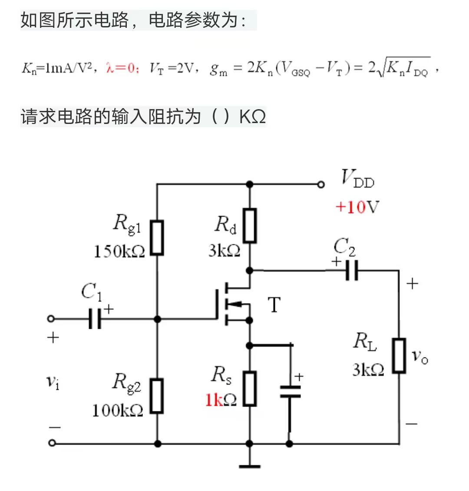

题目一共有三个问
1. 求$A_{v}=\frac{v_o}{v_i}$

>令$v_i=0$：
$V_{GSQ}=V_{DD}\frac{R_{g1}}{R_{g1}+R_{g2}}-I_{DQ}R_S$
$I_{DQ}=K_n(V_{GSQ}-V_T)^2$
解得$I_{DQ}=1mA$
$g_m=2\sqrt{K_nI_{DQ}}=2mS$
又$\lambda=0$
$R_o=\frac{R_dR_L}{R_d+R_L}$
$A_{v}=-g_mR_o=-3$

2. 求输入阻抗
>输入阻抗为R_{g1},R_{g2}并联
$R_i=\frac{R_{g1}R_{g2}}{R_{g1}+R_{g2}}=60k\Omega$
3. 求输出阻抗
> 即$R_L$